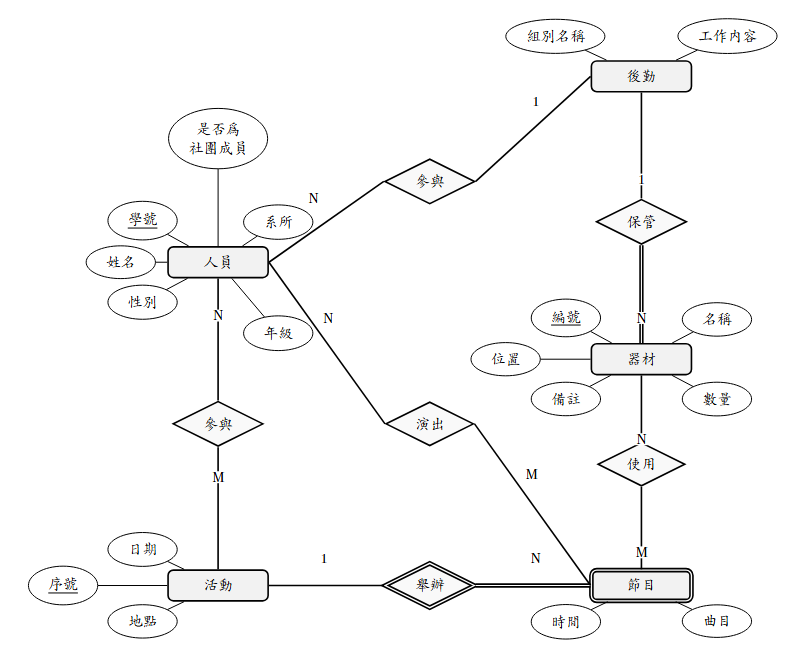
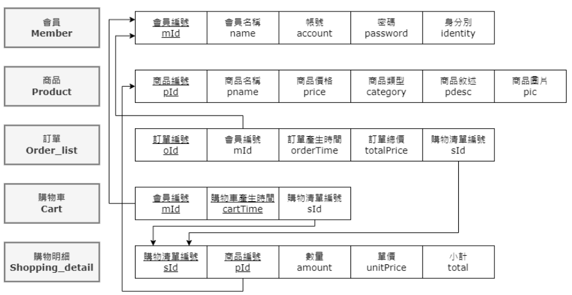

# 活動管理系統
## ERD

## 目標資料庫綱要

# 中山網路書店

一套使用Flask開發的網路書店系統，後端使用Postgres資料庫

## 原始資料綱要

## 原始架構

- 「 static 」：存圖檔和資料格式（ CSS ）檔
- 「 templates 」：存登入和註冊的 html 檔
- 「 api 」：存登入的控制程式 api.py 和資料庫存取程式 sql.py
- 「 bookstore 」 ：存一般使用者功能的控制程式和相關的 html 檔
- 「 backstage 」 ：存管理者功能的控制程式和相關的 html 檔

## 功能

- 提供CRUD範例，並搭配資料分析功能。
- 以MVC架構開發。
- 一般消費者可以瀏覽、搜尋、購買商品，並查看訂單狀態。
- 後台管理者可以編輯商品，並檢視每筆訂單以及商品銷售圖表。

## 介面範例

> 點選以下連結體驗系統功能: https://bookstore.tarflow.com/

## 詳細說明
原始來源： https://github.com/Text-Analytics-and-Retrieval/DB_CLASS_2025

